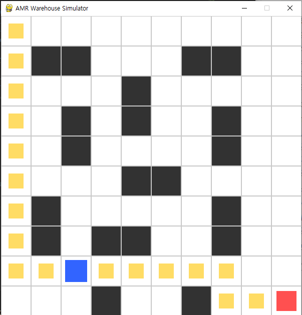
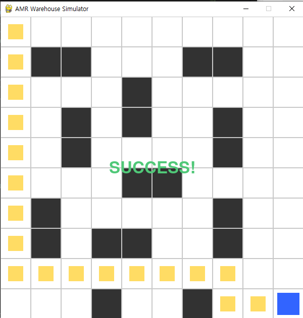
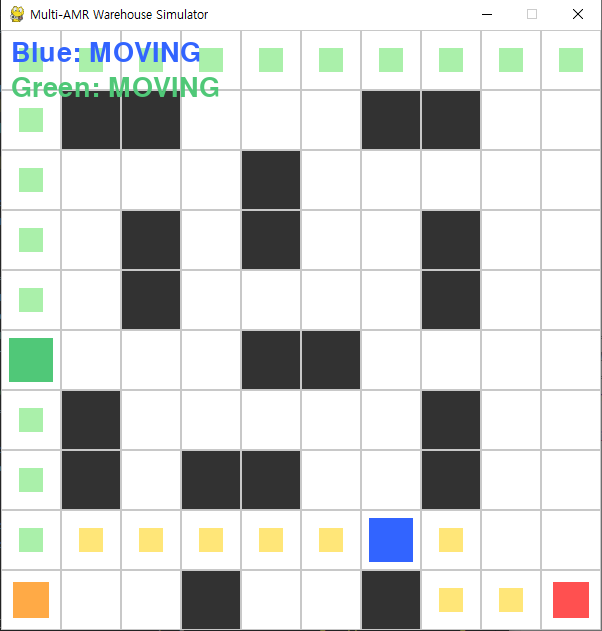
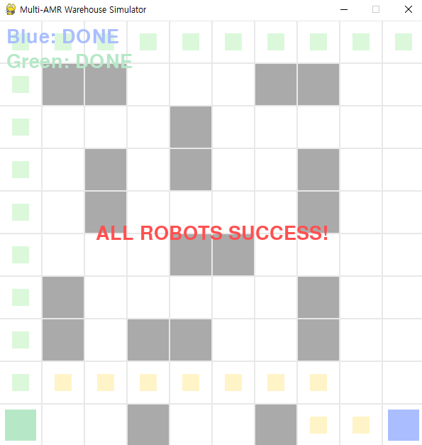
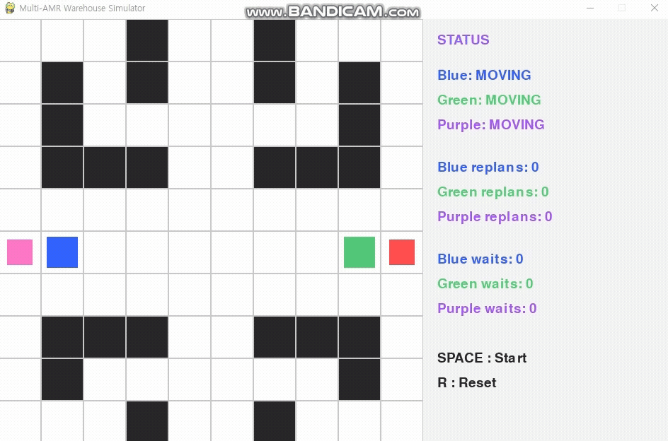

  
  

### 최단거리 경로를 이용한 시뮬레이션 결과
왼쪽: A* 기반 경로 계획(Path Planning)  
오른쪽: 계획된 경로를 따른 자율 주행 및 목표 도달

  
  

### 다중 로봇 환경에서 시뮬레이션 결과
다중 AMR 환경에서 각 로봇이 독립적으로 경로를 생성하며 이동

  

### 다중 로봇 환경에서 시뮬레이션 결과(회피, 경로 재탐색)
다중 로봇 환경에서 충돌 회피 및 경로 재탐색을 통해 모든 로봇이 목표에 도달
